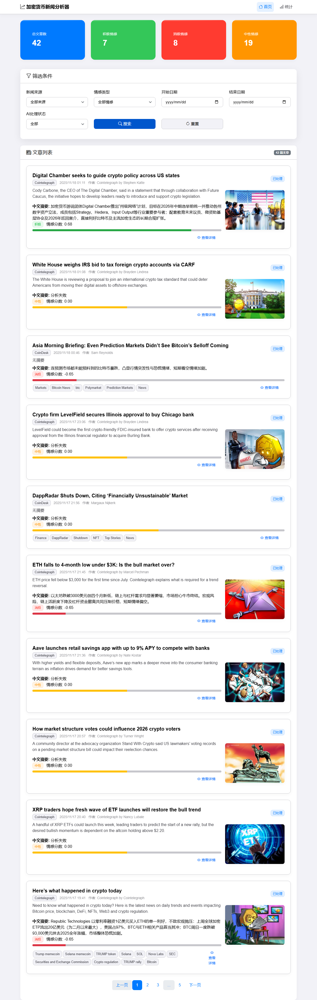
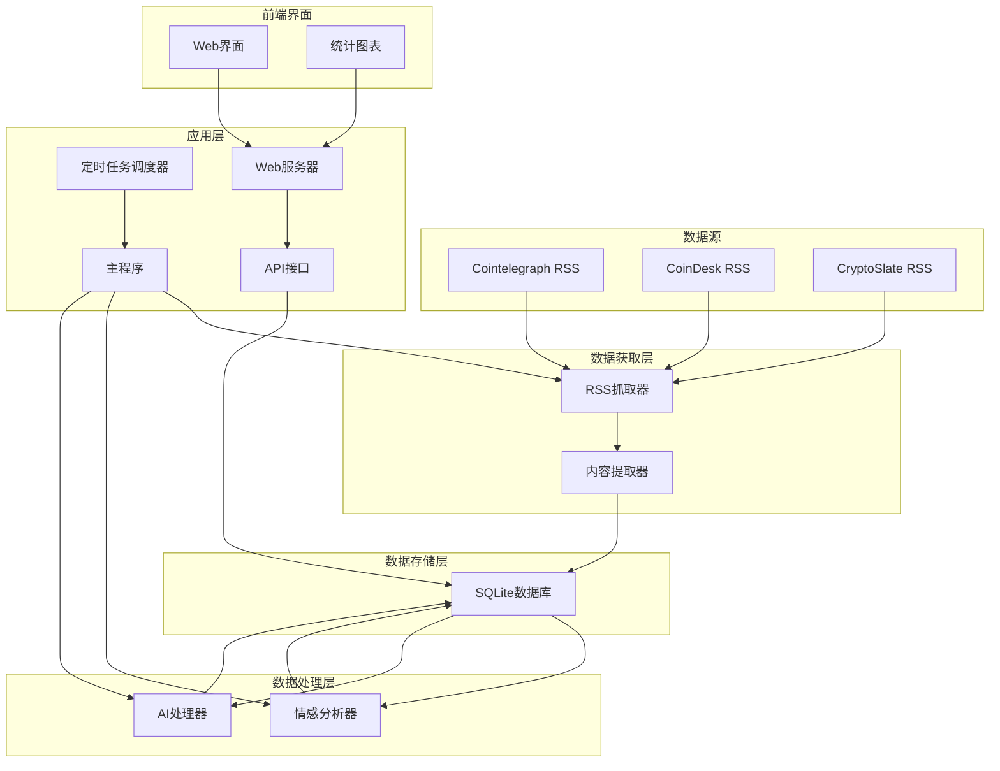
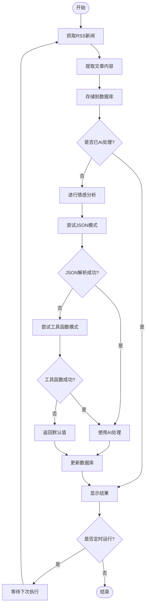

# 📈 加密货币新闻分析器

[](https://python.org)
[](LICENSE)
[](https://github.com/Ibook000/crypto-news-analyzer)

一个强大的加密货币新闻分析工具，可以自动抓取、分析并存储加密货币相关新闻，包括情感分析和AI处理功能。

## 🌟 功能特点

- 🔄 **自动新闻抓取**：从多个知名加密货币新闻源（Cointelegraph、CoinDesk、CryptoSlate）自动抓取最新新闻
- 🧠 **智能情感分析**：使用AI技术对新闻内容进行情感分析，判断市场情绪
- 🔄 **混合Function Call模式**：结合JSON模式和工具函数模式，确保高可靠性分析
- 📊 **数据处理**：提取关键信息并存储到结构化数据库中
- ⏰ **定时任务**：支持定时自动执行，持续监控市场动态
- 🌐 **内容提取**：使用高级技术提取完整文章内容
- 🌐 **Web界面**：提供直观的Web界面查看分析结果
- 📡 **API服务**：RESTful API接口，支持外部集成
- 📈 **市场洞察**：通过分析新闻情感帮助了解市场趋势
- 🛡️ **健壮错误处理**：完善的错误处理和日志记录系统

## 📋 目录

- [安装指南](#安装指南)
- [快速开始](#快速开始)
- [项目结构](#项目结构)
- [使用说明](#使用说明)
- [配置选项](#配置选项)
- [API参考](#api参考)
- [Web界面](#web界面)
- [架构图](#架构图)
- [贡献指南](#贡献指南)
- [许可证](#许可证)

## 🚀 安装指南

### 环境要求

- Python 3.11 或更高版本
- SQLite 3
- 网络连接（用于抓取新闻和AI分析）

### 安装步骤

1. **克隆仓库**
   ```bash
   git clone https://github.com/Ibook000/crypto-news-analyzer.git
   cd crypto-news-analyzer
   ```

2. **创建虚拟环境**
   ```bash
   python -m venv venv
   # Windows
   venv\Scripts\activate
   # macOS/Linux
   source venv/bin/activate
   ```

3. **安装依赖**
   ```bash
   pip install -r requirements.txt
   # 或者使用uv（推荐）
   uv sync
   ```

4. **配置环境变量**
   ```bash
   cp config/config.example.py config/config.py
   # 编辑config/config.py，添加必要的API密钥
   ```

## ⚡ 快速开始

### 1. 抓取新闻

```bash
# 执行一次性新闻抓取
python utils/fetch_and_save.py
```

### 2. AI处理新闻

```bash
# 处理未处理的新闻文章
python utils/ai_processor.py
```

### 3. 运行主程序

```bash
# 启动定时抓取服务（每小时执行一次）
python main.py
```

### 4. 启动Web界面

```bash
# 启动Web服务器
python web/run_server.py
# 或者
python web/api_server.py
```

然后在浏览器中访问 http://localhost:8000

### 5. 查看统计信息

```bash
# 查看数据库中的统计信息
python ai_main.py stats
```

## 📁 项目结构

```
crypto-news-analyzer/
├── ai/                     # AI分析模块
│   ├── SentimentAnalyzer.py # 情感分析器（支持混合模式）
│   └── __init__.py
├── config/                 # 配置文件
│   ├── config.py          # 主配置文件
│   └── __init__.py
├── data/                   # 数据文件
│   ├── coindesk.json      # CoinDesk RSS配置
│   ├── cointelegraph.json # Cointelegraph RSS配置
│   └── cryptoslate.json   # CryptoSlate RSS配置
├── database/               # 数据库模块
│   ├── operations.py      # 数据库操作
│   ├── crypto_news.db     # SQLite数据库
│   └── __init__.py
├── docs/                   # 文档
│   └── diagrams.md        # 架构图和流程图
├── fetchers/               # 数据抓取模块
│   ├── rss_fetcher.py     # RSS抓取器
│   ├── context_extractor.py # 内容提取器
│   └── __init__.py
├── utils/                  # 工具模块
│   ├── fetch_and_save.py  # 抓取和保存工具
│   └── ai_processor.py    # AI处理工具
├── web/                    # Web界面和API
│   ├── api_server.py      # API服务器
│   ├── run_server.py      # Web服务器启动脚本
│   ├── static/            # 静态资源
│   └── templates/         # HTML模板
├── main.py                 # 主程序入口
├── pyproject.toml         # 项目配置
└── README.md              # 项目文档
```

## 📖 使用说明

### 命令行选项

#### 主程序 (main.py)

```bash
# 启动定时服务（默认每小时执行一次）
python main.py

# 可通过修改main.py中的schedule设置调整执行频率
```

#### AI处理器 (utils/ai_processor.py)

```bash
# 处理未处理的新闻（默认处理5篇）
python utils/ai_processor.py

# 在Python代码中使用
from utils.ai_processor import process_unprocessed_articles
result = process_unprocessed_articles(batch_size=10)
print(f"处理了{result['processed']}篇文章，成功{result['success']}篇")
```

#### Web服务器 (web/api_server.py)

```bash
# 启动Web服务器
python web/api_server.py

# 启动后访问 http://localhost:8000
```

#### 示例程序 (ai_main.py)

```bash
# 查看统计信息
python ai_main.py stats

# 执行单次AI处理
python ai_main.py single

# 启动持续处理（每30分钟检查一次）
python ai_main.py continuous
```

### 数据库操作

```python
from database.operations import Database

# 初始化数据库
db = Database("sqlite:///database/crypto_news.db")

# 获取未处理的文章
articles = db.get_unprocessed_articles(limit=10)

# 更新文章
success = db.update_article(article_id, {
    'sentiment': 'positive',
    'sentiment_score': 0.8,
    'chinese_summary': '文章摘要',
    'ai_processed': True
})

# 获取情感分析结果
positive_articles = db.get_sentiment_articles('positive', limit=5)
```

## ⚙️ 配置选项

在 `config/config.py` 中可以配置以下选项：

```python
# RSS源配置
RSS_SOURCES = {
    'cointelegraph': {
        'url': 'https://cointelegraph.com/rss',
        'name': 'Cointelegraph'
    },
    'coindesk': {
        'url': 'https://www.coindesk.com/arc/outboundfeeds/rss/',
        'name': 'CoinDesk'
    },
    'cryptoslate': {
        'url': 'https://cryptoslate.com/feed/',
        'name': 'CryptoSlate'
    }
}

# 数据库配置
DB_URL = 'sqlite:///database/crypto_news.db'

# AI服务配置
BASE_URL = "https://api.openai.com/v1/chat/completions"
API_KEY = "your-api-key-here"
MODEL = "gpt-3.5-turbo"

# 抓取配置
FETCH_INTERVAL = 3600  # 抓取间隔（秒）
REQUEST_TIMEOUT = 30   # 请求超时时间（秒）
```

## 📊 API参考

### SentimentAnalyzer类

```python
from ai.SentimentAnalyzer import SentimentAnalyzer

analyzer = SentimentAnalyzer()

# 分析文章情感（使用混合模式）
sentiment, score, summary = analyzer.analyze(title, content)

# 直接使用工具函数模式
sentiment, score, summary = analyzer.analyze_with_tools(title, content)
```

### 数据库操作

```python
from database.operations import Database

db = Database(db_url)

# 获取文章
articles = db.get_unprocessed_articles(limit=10)
positive_articles = db.get_sentiment_articles('positive', limit=5)

# 更新文章
db.update_article(article_id, update_data)
```

### Web API端点

```bash
# 获取文章列表
GET /api/articles

# 获取文章详情
GET /api/articles/{id}

# 获取情感分析统计
GET /api/sentiment-stats

# 获取新闻来源
GET /api/sources

# 获取情感类型
GET /api/sentiments
```

## 🌐 Web界面

项目提供了一个直观的Web界面，可以：

- 📊 查看情感分析统计图表
- 📰 浏览最新新闻文章
- 🔍 按情感类型筛选文章
- 📱 响应式设计，支持移动设备
- 🔄 实时更新数据

启动Web服务器后，在浏览器中访问 http://localhost:8000 即可使用。

### 界面预览



### 情感分析混合模式

我们的情感分析器采用了创新的混合模式，结合了两种Function Call方法：

1. **JSON模式**（优先使用）：更快速、更直接
2. **工具函数模式**（备用方案）：更可靠、更结构化

当JSON模式解析失败时，系统会自动切换到工具函数模式，确保分析的高可靠性。

## 🏗️ 架构图

### 项目架构图



### 数据流程图



更多详细的架构图和流程图，请参考 [docs/diagrams.md](docs/diagrams.md)。

## 🤝 贡献指南

我们欢迎所有形式的贡献！无论是报告bug、提出功能请求，还是提交代码。

### 如何贡献

1. **Fork** 本仓库
2. 创建您的功能分支 (`git checkout -b feature/AmazingFeature`)
3. 提交您的更改 (`git commit -m 'Add some AmazingFeature'`)
4. 推送到分支 (`git push origin feature/AmazingFeature`)
5. 打开一个 **Pull Request**

### 开发指南

- 确保代码符合PEP 8规范
- 添加适当的注释和文档字符串
- 为新功能编写测试
- 确保所有测试通过

## 📄 许可证

本项目采用 Apache License 2.0 许可证。详情请参阅 [LICENSE](LICENSE) 文件。

## 🙏 致谢

- [Cointelegraph](https://cointelegraph.com/) - 提供加密货币新闻
- [CoinDesk](https://www.coindesk.com/) - 提供加密货币新闻
- [CryptoSlate](https://cryptoslate.com/) - 提供加密货币新闻
- [Trafilatura](https://github.com/adbar/trafilatura) - 用于网页内容提取
- [Beautiful Soup](https://www.crummy.com/software/BeautifulSoup/) - 用于HTML解析
- [OpenAI](https://openai.com/) - 提供强大的AI分析能力

## 📞 联系方式

- 项目主页：https://github.com/Ibook000/crypto-news-analyzer
- 问题反馈：https://github.com/Ibook000/crypto-news-analyzer/issues
- 邮箱：ibook@outlook.be
- 微信：IBO0OK

---

⭐ 如果这个项目对您有帮助，请给我们一个星标！