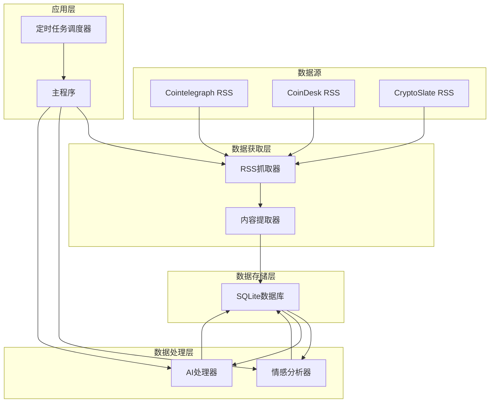
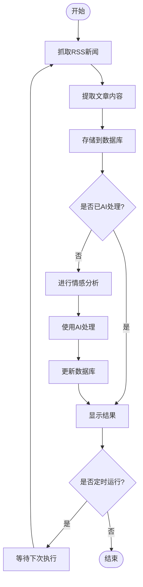
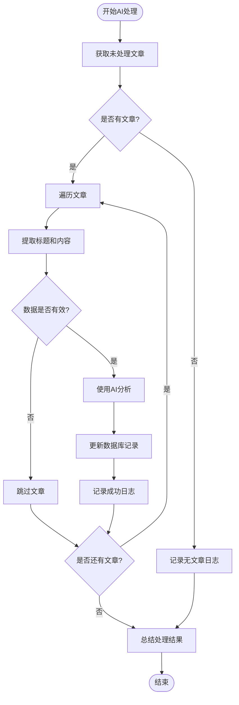
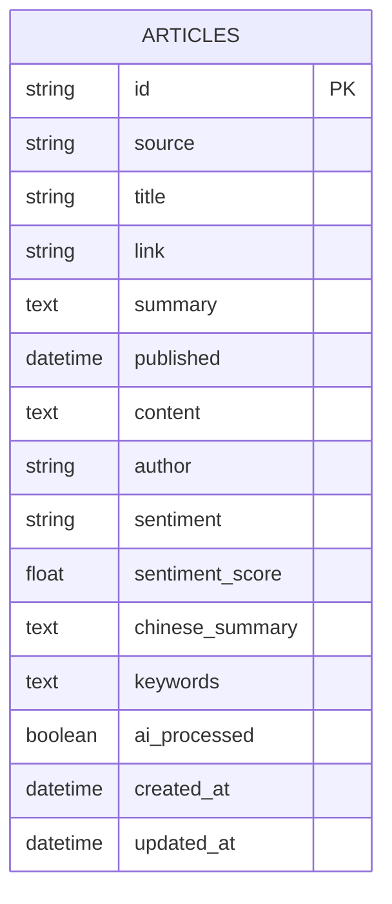
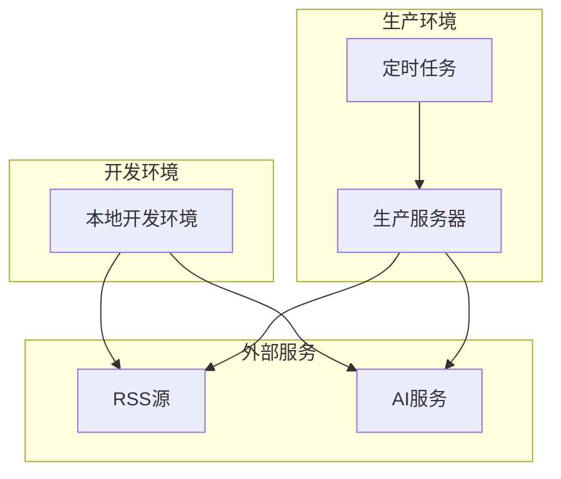

# 加密货币新闻分析器 - 架构图和流程图

## 项目架构图

```mermaid
graph TB
    subgraph "数据源"
        A1[Cointelegraph RSS]
        A2[CoinDesk RSS]
        A3[CryptoSlate RSS]
    end
    
    subgraph "数据获取层"
        B1[RSS抓取器]
        B2[内容提取器]
    end
    
    subgraph "数据处理层"
        C1[情感分析器]
        C2[AI处理器]
    end
    
    subgraph "数据存储层"
        D1[SQLite数据库]
    end
    
    subgraph "应用层"
        E1[主程序]
        E2[定时任务调度器]
    end
    
    A1 --> B1
    A2 --> B1
    A3 --> B1
    B1 --> B2
    B2 --> D1
    D1 --> C1
    D1 --> C2
    C1 --> D1
    C2 --> D1
    E1 --> B1
    E1 --> C1
    E1 --> C2
    E2 --> E1
```

## 数据流程图

```mermaid
flowchart TD
    Start([开始]) --> FetchNews[抓取RSS新闻]
    FetchNews --> ExtractContent[提取文章内容]
    ExtractContent --> StoreArticle[存储到数据库]
    StoreArticle --> CheckAI{是否已AI处理?}
    CheckAI -->|否| AnalyzeSentiment[进行情感分析]
    CheckAI -->|是| DisplayResult[显示结果]
    AnalyzeSentiment --> ProcessWithAI[使用AI处理]
    ProcessWithAI --> UpdateDB[更新数据库]
    UpdateDB --> DisplayResult
    DisplayResult --> Schedule{是否定时运行?}
    Schedule -->|是| Wait[等待下次执行]
    Schedule -->|否| End([结束])
    Wait --> FetchNews
```

## AI处理流程图

```mermaid
flowchart TD
    StartAI([开始AI处理]) --> GetArticles[获取未处理文章]
    GetArticles --> CheckArticles{是否有文章?}
    CheckArticles -->|否| LogNoArticles[记录无文章日志]
    CheckArticles -->|是| ProcessLoop[遍历文章]
    ProcessLoop --> ExtractData[提取标题和内容]
    ExtractData --> CheckData{数据是否有效?}
    CheckData -->|否| SkipArticle[跳过文章]
    CheckData -->|是| AnalyzeWithAI[使用AI分析]
    AnalyzeWithAI --> UpdateRecord[更新数据库记录]
    UpdateRecord --> LogSuccess[记录成功日志]
    SkipArticle --> NextArticle{是否还有文章?}
    LogSuccess --> NextArticle
    NextArticle -->|是| ProcessLoop
    NextArticle -->|否| Summarize[总结处理结果]
    LogNoArticles --> Summarize
    Summarize --> EndAI([结束])
```

## 数据库表结构图

```mermaid
erDiagram
    ARTICLES {
        string id PK
        string source
        string title
        string link
        text summary
        datetime published
        text content
        string author
        string sentiment
        float sentiment_score
        text chinese_summary
        text keywords
        boolean ai_processed
        datetime created_at
        datetime updated_at
    }
```

## 部署架构图

```mermaid
graph TB
    subgraph "开发环境"
        Dev[本地开发环境]
    end
    
    subgraph "生产环境"
        Prod[生产服务器]
        Cron[定时任务]
    end
    
    subgraph "外部服务"
        RSS[RSS源]
        AI[AI服务]
    end
    
    Dev --> RSS
    Dev --> AI
    Prod --> RSS
    Prod --> AI
    Cron --> Prod
```